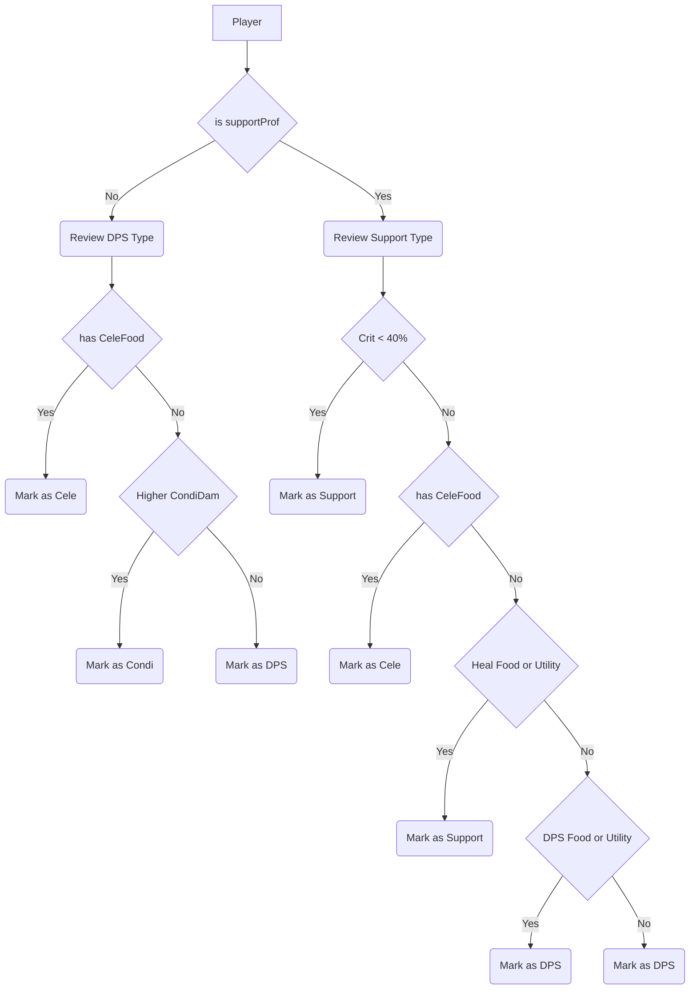

```mermaid
flowchart TD
    Start[Player] --> a{is supportProf}
    a --> |No| b(Review DPS Type)
    a --> |Yes| c(Review Support Type)
    b --> d{has CeleFood}
    d --> |Yes| e(Mark as Cele)
    d --> |No| f{Higher CondiDam}
    f --> |Yes| g(Mark as Condi)
    f --> |No| h(Mark as DPS)
    c --> i{Crit < 40%}
    i --> |Yes|j(Mark as Support)
    i --> |No|k{has CeleFood}
    k --> |Yes|l(Mark as Cele)
    k --> |No|m{Heal Food or Utility}
    m --> |Yes|n(Mark as Support)
    m --> |No|o{DPS Food or Utility}
    o --> |Yes|p(Mark as DPS)
    o --> |No|q(Mark as DPS)
```
